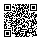

# CollidePD

**CollidePd** is a networked musical instrument that runs on any browser.

There is no log-in. It is anonymous. We don't track you or store your data. You just connect with people live and play music together.

The code is open source and it is hosted on [Github](https://github.com/fdch/collidepd).

## Instructions

1. Go to the website (see below).
2. Hit <code>Start</code> to start playing.
3. Hit <code>Stop</code> to stop playing.
4. Hit <code>Chat</code> to chat with others.
5. Hit <code>Instructions</code> to read the instructions.

### THINGS TO CONSIDER

It will sound better on headphones.

**Some things might be LOUD.**

**Do not** bring the volume slider all the way up.

You will have *more fun on a smartphone*, than on a computer with a mouse.

There is a *small delay* between what you play and what you listen.

If live-streamed, there will be a 20 second delay between what you listen on your device and on the live stream.

## Scan the following QR code to play or go to: <https://collidepd.herokuapp.com>

### Privacy Policy

We don't track you.

We don't store your data.

We want to play music together with you. That's it.

### Authors

Fede Cámara Halac - <https://fdch.github.io>

Federico Ragessi - <https://github.com/ffrm>

### Credits

QR code generated with <https://github.com/nayuki/QR-Code-generator>

Tone.js: <https://tonejs.github.io>

NexusUI.js: <https://nexus-js.github.io/ui>

socket.io:<https://socket.io>

Node.js: <https://nodejs.org>
